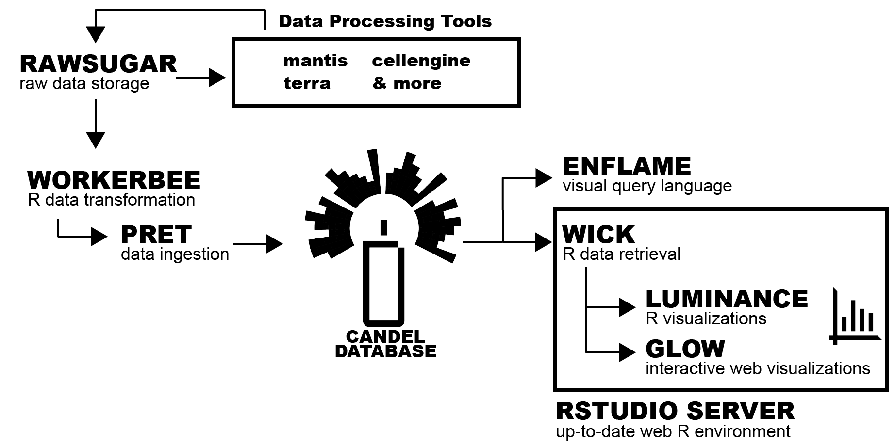
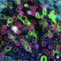

## Overview

Welcome to CANDELbio! Our documentation will eventually be here.

## Key Links

- [Public CANDEL enflame dashboard]()
- [Dataset Descriptions]()
- [Interactive CANDEL schema viewer]()

## CANDEL Platform: informatics software suite

The CANDEL Platform encompasses the universe of tools we use to store, analyze, query and plot data. This includes the CANDEL database itself!

###### R packages
- [luminance](https://github.com/CANDELbio/luminance/blob/master/README.md): visualize data from CANDEL
- [workerbee](https://github.com/CANDELbio/workerbee/blob/master/README.md): process your data for ingestion into CANDEL
- [wick](https://github.com/CANDELbio/wick/blob/master/README.md): get data out of CANDEL in a table format
- [datalogr](https://github.com/CANDELbio/datalogr/blob/master/README.md): generate custom queries for CANDEL
- [glow](https://github.com/CANDELbio/glow/blob/main/README.md): deploy a shiny UI for visualization of a CANDEL project

### CANDEL Database: where the processed data lives 

The CANDEL database is where most useable data lives in the form of measurements linked to relevant sample metadata and patient clinical data. 

To see what kind of data we keep in CANDEL, try checking out the [schema](), which is explained in great detail [here](https://candelbio.github.io/candel-bio-website/candel_database/schema/).

### Enflame: explore the CANDEL database without learning to code!

[Enflame](https://candelbio.github.io/candel-bio-website/data_analysis/enflame/) is a visual query builder for the CANDEL dabase. You can construct a query by combining blocks. You can then run the query against a selected CANDEL database, or you can take the generated text representation of it in wick, and include it in your own code. Enflame also includes the ability to do some simple data visualization on the returned data, also by using blocks and block structure (see Visualization blocks).

### Rawsugar: where the raw data lives

[Rawsugar]() is PICI՚s tool for raw data ingestion, storage, and retrieval. The [user guide for rawsugar can be found here](https://github.com/candelbio/rawsugar/blob/master/doc/user-guide.org) and will walk you through ingesting and organizing raw data in rawsugar! 

### Mantis: imaging analysis made simple
 

[Mantis Viewer](https://candelbio.github.io/mantis-viewer/) is an application for viewing and analyzing multi-channel pathology imaging, such as IHC, Vectra, MIBI, IMC, CODEX, or other technologies. It has been designed to be highly performant and responsive when analyzing both large and small images and to support workflows with segmentation data.

- [Current Release](https://github.com/candelbio/mantis-viewer/releases)

### Terra: for running complex pipelines on lots of samples

 
[Terra](https://app.terra.bio) is a cloud based workflow runner developed by the Broad Institute for handing large genomics pipelines in parallel. We use it for Because it runs off of docker images, we can use it for much more than genomics work, including segmentation of cells in images.

